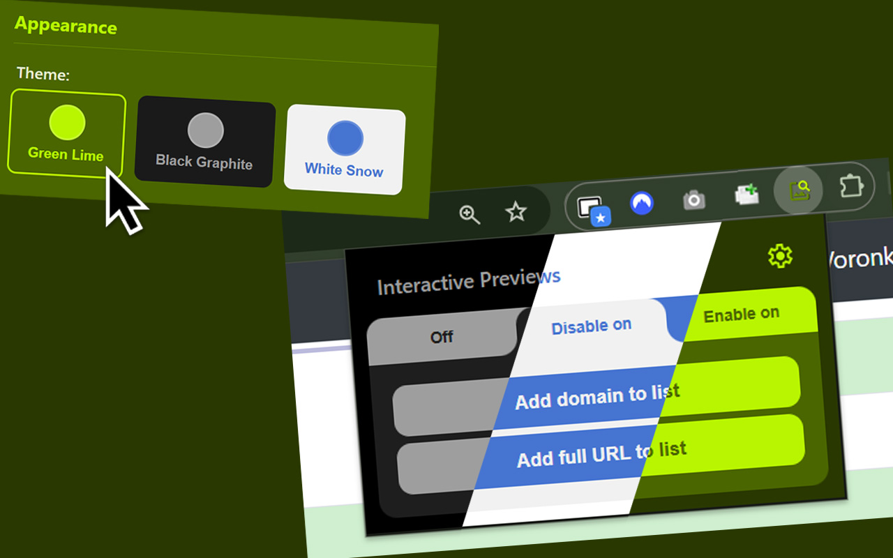
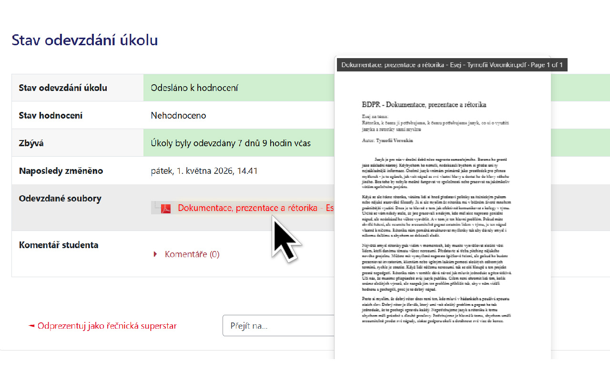
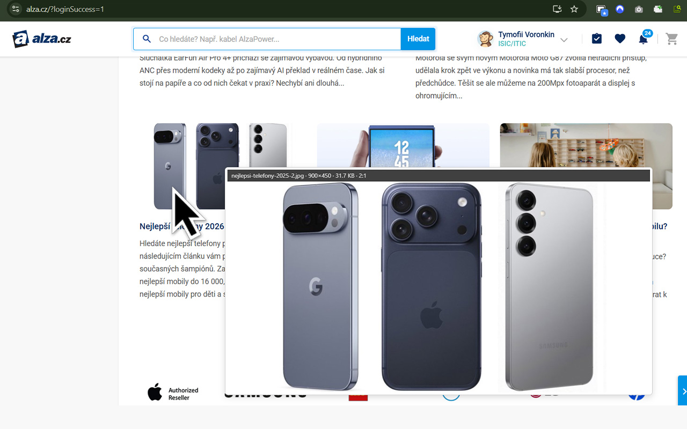
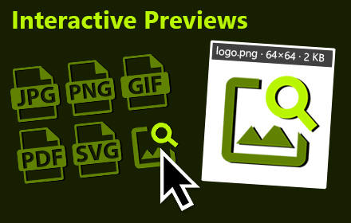

<!-- _class: title-slide -->
<!-- _paginate: false -->

# Rozšíření webového prohlížeče pro interaktivní náhledy souborů

## Obhajoba bakalářské práce

  

    

      
Autor práce

      
Tymofii Voronkin

    

    

      
Vedoucí práce

      
Mgr. Tomáš Hudec

    

  

  

    

      
Instituce

      
Univerzita Pardubice Fakulta Elektrotechniky a Informatiky

    

    

      
Datum obhajoby

      
3. června 2026

    

  

---

# Cíle bakalářské práce

- **Vývoj moderního rozšíření** pro webové prohlížeče (Google Chrome a Mozilla Firefox).
- **Zvýšení uživatelského komfortu (UX)** a efektivity při každodenním procházení webu.
- **Interaktivní náhledy na najetí myši** (hover) bez nutnosti stahovat soubory na disk nebo otevírat nové panely.
- **Podpora různých formátů** souborů s důrazem na obrázky ve vysokém rozlišení a dokumenty PDF.
- **Možnost pokročilé konfigurace** (filtrování domén, zpoždění zobrazení, klávesové modifikátory).

---

# Teoretická základna

### Manifest Version 3 (MV3)

- Moderní standard pro webová rozšíření.
- Využití event-driven **Service Workerů** běžících na pozadí (výrazná úspora paměti RAM).
- Vyšší bezpečnost a kontrola oprávnění.

### Responzivní obrázky

- Analýza atributů `srcset` a `sizes`.
- Extrakce a načtení obrázků v **nejvyšším dostupném rozlišení**.

### Události v JavaScriptu (DOM)

- Obsluha událostí `mouseover`, `mouseout`, `mousemove`.
- **Event Delegation** pro odchytávání událostí na celém dokumentu.
- Optimalizace přes **debounce/throttle** proti zamrzání UI.

### Asynchronní Fetch API

- Použití `Promises` a `async/await` pro stahování dat bez blokování hlavního vlákna.

---

# Analýza existujících řešení

  <h3>Hover Zoom+</h3>
  
Open-source s dlouhou historií

  <ul>
    <li>✔ Podpora mnoha webů</li>
    <li>❌ Zastaralé rozhraní</li>
    <li>❌ Nepřehledná nastavení</li>
    <li>❌ Chybí podpora PDF</li>
  </ul>

  <h3>Imagus Reborn</h3>
  
Komunitní nástupce Imagusu

  <ul>
    <li>✔ Rychlá detekce (Sieve)</li>
    <li>❌ Složitá pravidla Sieve</li>
    <li>❌ Projekt upadá (abandon)</li>
    <li>❌ Chybí podpora PDF</li>
  </ul>

  <h3>Interactive Previews</h3>
  
Moderní design a čisté UI/UX

  <ul>
    <li>✔ Nativní podpora PDF</li>
    <li>✔ Plná kompatibilita s MV3</li>
    <li>✔ RegExp filtry domén</li>
    <li>✔ Rychlá odezva bez záseků</li>
  </ul>

---

# Praktická realizace — Architektura

- **Content Scripts**: Skripty injektované do stránek. Detekují kurzor, vytvářejí náhledy a obsluhují panel Info Bar.
- **Service Worker (Background)**: Běží na pozadí jako proxy pro síťové požadavky (obcházení restrikcí CORS).
- **Uživatelské rozhraní**: Popup okno pro rychlé akce a Options stránka pro plnou konfiguraci.
- **chrome.storage.sync**: Asynchronní ukládání a synchronizace nastavení napříč prohlížeči.

---

# Uživatelské rozhraní (UI)

### Options & Popup

- **Popup okno**: Rychlý přepínač stavu rozšíření na aktuální doméně s podporou barevných motivů.
- **Options stránka**: Nabízí pokročilou konfiguraci zpoždění (delay), modifikátorů kláves, typů souborů a struktury panelu Info Bar.
- **Filtrování domén**: Režimy Blocklist a Allowlist s přímou podporou **regulárních výrazů (RegExp)** pro snadné pokrytí celých skupin webů.

---

# Integrace a zobrazení PDF

- **Detekce odkazů**: Rozpoznání odkazů směřujících na `.pdf` soubory.
- **Asynchronní stahování**: Service Worker na pozadí načte první bloky dat přes Fetch API.
- **Knihovna PDF.js**: Výpočetně náročné dekódování probíhá ve **Web Workeru**, což brání zásekům rozhraní.
- **Canvas Rendering**: První strana dokumentu se vykreslí na dynamický `<canvas>`.
- **Textová a odkazová vrstva**: Umožňuje přímý výběr textu a proklik odkazů uvnitř náhledu.

---

<!-- _class: screenshot-slide -->

# Testování: Náhledy PDF (Moodle UPCE)

  Okamžité zobrazení první strany studijních materiálů v e-learningovém systému bez stahování na disk.

---

<!-- _class: screenshot-slide -->

# Testování: Náhledy produktů (E-shop Alza)

  Zobrazení produktových fotografií v nejvyšším rozlišení s plynulým sledováním kurzoru.

---

# Závěr a budoucí vývoj

### Zhodnocení výsledků

- Cíle bakalářské práce byly **plně splněny**.
- Bylo vyvinuto bezpečné, uživatelsky přívětivé a výkonově optimalizované rozšíření.
- Odstraněna nutnost stahování nepotřebných souborů při rychlé inspekci obsahu.
- Úspěšně otestována komunikace komponent a stabilita na produkčních portálech.

### Směr dalšího vývoje

- **HTTP Range Requests**: Stahování pouze nezbytných úvodních dat u obřích PDF dokumentů.
- **Podpora kancelářských formátů**: Analýza bezpečného offline renderování `.docx`, `.xlsx` apod.
- **Chrome Web Store / Firefox Add-ons**: Dokončení schvalovacího procesu pro veřejné stažení.

---

<!-- _class: compact-slide -->

# Otázky k obhajobě (1/3)

  
Jak obtížné by bylo implementovat zmíněné náměty na vylepšení?

  <h4>Odpověď:</h4>
  <ul>
    <li><strong>Mute video náhledy</strong>: <em>Nízká obtížnost</em>. Logika je obdobná jako u obrázků, avšak videa byla záměrně vynechána kvůli úspoře RAM a zamezení rušivého přehrávání zvuku.</li>
    <li><strong>HTTP Range Requests (pro PDF)</strong>: <em>Střední obtížnost</em>. Vyžaduje úpravu Service Workeru pro stahování dat po částech a konfiguraci parseru PDF.js pro asynchronní načítání bloků dat.</li>
    <li><strong>Podpora DOCX / XLSX</strong>: <em>Vysoká obtížnost</em>. Offline renderování v prohlížeči vyžaduje integraci rozsáhlých knihoven (nárůst velikosti kódu). Použití externích API (např. Google Docs Viewer) je jednodušší, ale nese rizika narušení soukromí.</li>
  </ul>

---

<!-- _class: compact-slide -->

# Otázky k obhajobě (2/3)

  
Text práce byl napsán v LaTeXu. Jak toto rozhodnutí hodnotíte zpětně z hlediska přínosu a obtížnosti zpracování?

  <h4>Odpověď:</h4>
  <ul>
    <li><strong>Zpětné hodnocení</strong>: Rozhodnutí hodnotím <strong>velmi pozitivně</strong>. LaTeX zajistil bezchybný a profesionální typografický vzhled podle šablony UPCE.</li>
    <li><strong>Přínosy</strong>: Automatizovaná správa citací (BibLaTeX), křížových odkazů, obsahu a rejstříků. Skvělá podpora pro vkládání ukázek zdrojového kódu (balíček <code>listings</code>).</li>
    <li><strong>Obtížnost a workflow</strong>: Náročnost spočívala v počáteční křivce učení a čase kompilace. To bylo vyřešeno spuštěním kontinuálního překladu pomocí <code>latexmk -pdf -pvc main.tex</code> v kombinaci se čtečkou SumatraPDF, která nezamyká soubory pro zápis a okamžitě zobrazuje změny.</li>
  </ul>

---

<!-- _class: compact-slide -->

# Otázky k obhajobě (3/3)

  
Počítáte se zveřejněním na oficiálních stránkách rozšíření pro Firefox / Chrome?

  <h4>Odpověď:</h4>
  

  <ul>
    <li><strong>Chrome Web Store</strong>: Dne <strong>28. 5. 2026</strong> byla odeslána žádost o schválení. Rozšíření aktuálně prochází schvalovacím procesem.</li>
    <li><strong>Doba schvalování</strong>: Google upozornil na delší dobu schvalování kvůli <code>&lt;all_urls&gt;</code> v host permissions, která jsou však nezbytná pro fungování náhledů na libovolném webu.</li>
    <li><strong>Iniciativa</strong>: Mým cílem bylo projít si kompletní produkční cyklus od vývoje po vydání, včetně tvorby vizuálních promo-materiálů a vyplnění obchodních deklarací.</li>
  </ul>

---

<!-- _class: thank-you-slide -->
<!-- _paginate: false -->

# Děkuji za pozornost!

Tymofii Voronkin
